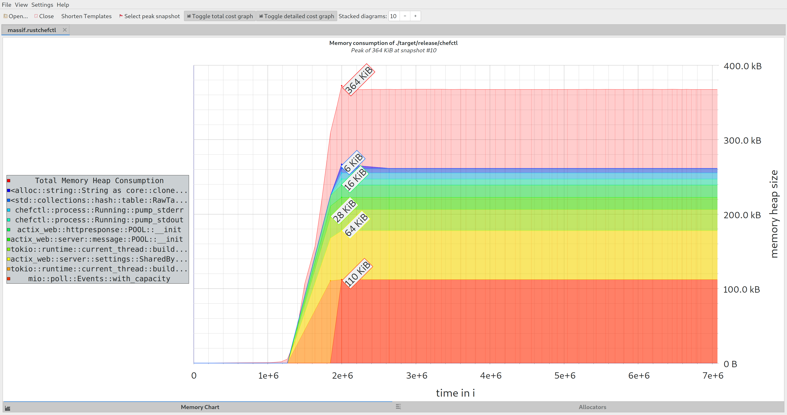

# An Oxidized `chefctl`

This was an experiment of mine to re-implement some of the functionality of the
[original project] in Rust. Outside of the change in languages the main
difference here is that the application is implementing a state machine
following a pattern from [this excellent blog post]. Note that this is not a
complete implementation, merely enough of a prototype to run some crude
benchmarks.

As one would expect Rust exhibits much better resource utilization than Ruby.
Check out some non-rigorous snapshots of performance on Linux and Windows.
The testing methodology was to invoke `chefctl -icH` and observe what was
going on with memory.

[this excellent blog post]: https://hoverbear.org/2016/10/12/rust-state-machine-pattern/
[original project]: https://github.com/facebook/chef-utils/tree/master/chefctl

## Linux

### Ruby

```bash
valgrind --tool=massif /usr/local/bin/chefctl -icH
```


### Rust

```bash
cargo build --release && valgrind --tool=massif ./target/release/chefctl
```



## Windows

In both screenshots Ruby is on the left and Rust is on the right. Telemetry was
captured with `procexp.exe`:


~Fin